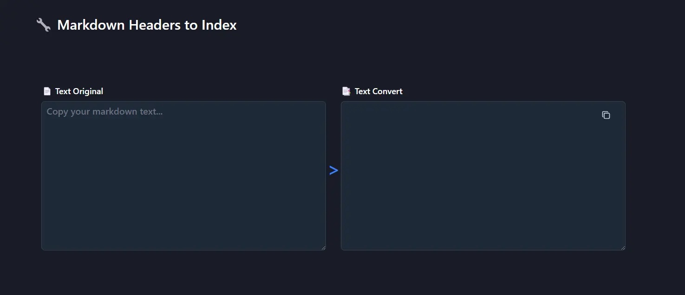
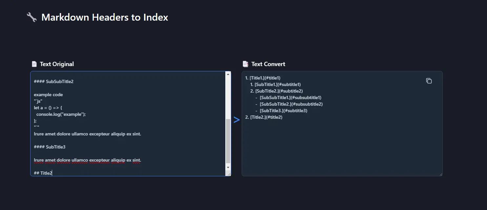

# 🔧 Markdown Headers to Index

Get headers and convert at index with links

## 📘 Instructions

Go to link: [md-headers-to-index.netlify.app](https://md-headers-to-index.netlify.app/)

Copy & paste your markdown text to "Text Original" input

✅ If all success a will be copy the result of convert headers to index of "Text Convert" input.

## Screenshots

### Before write markdown text

# <picture><source src="./src/assets/img/dark-screen-01.webp" media="(prefers-color-scheme: dark)" /><source src="./src/assets/img/light-screen-01.webp" media="(prefers-color-scheme: light)" /></picture>

### After write markdown text

# <picture><source src="./src/assets/img/dark-screen-02.webp" media="(prefers-color-scheme: dark)" /><source src="./src/assets/img/light-screen-02.webp" media="(prefers-color-scheme: light)" /></picture>

## 📒 Example

📄 Text Original

```md
## Title1

Irure amet dolore ullamco excepteur aliquip ex sint.

### SubTitle1

Exercitation deserunt eu ea proident non eu anim cillum sunt exercitation labore. Eu eu tempor amet est fugiat officia laboris ut irure nulla fugiat velit est. Exercitation quis labore in nulla.

### SubTitle2

#### SubSubTitle1

Irure amet dolore ullamco excepteur aliquip ex sint.

#### SubSubTitle2

example code
"`js"
let a = () => {
  console.log("example");
};
"`"
Irure amet dolore ullamco excepteur aliquip ex sint.

#### SubTitle3

Irure amet dolore ullamco excepteur aliquip ex sint.

## Title2
```

📑 Text Convert

```md
1. [Title1.](#title1)
   1. [SubTitle1.](#subtitle1)
   2. [SubTitle2.](#subtitle2)
      - [SubSubTitle1.](#subsubtitle1)
      - [SubSubTitle2.](#subsubtitle2)
      - [SubTitle3.](#subtitle3)
2. [Title2.](#title2)
```
